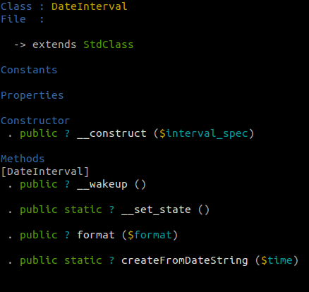

# Phish 

Phish is a command line documentation tool for PHP and currently under development ...

### Examples

Get info about the `DateInterval` class:

    phish info DateInterval

*Output:*

    

